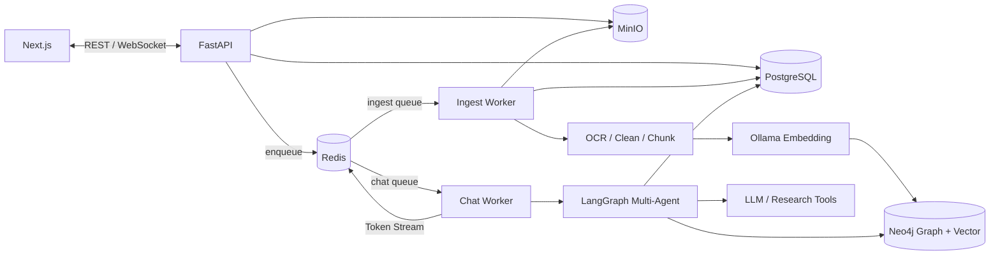
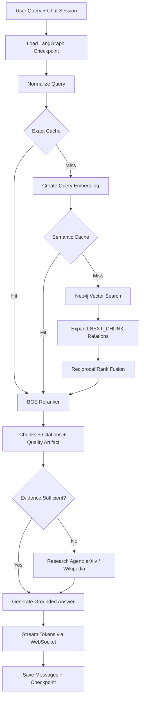

# Agent-RAG

Agent-RAG là nền tảng hỏi đáp tài liệu đa phương thức sử dụng kiến trúc multi-agent và Graph RAG. Hệ thống cho phép người dùng tải lên PDF, DOCX, Markdown hoặc hình ảnh, sau đó tự động OCR, phân đoạn, tạo embedding và xây dựng knowledge graph để trả lời câu hỏi theo đúng ngữ cảnh tài liệu.

## Điểm Nổi Bật

- Xây dựng orchestrator bằng LangGraph để điều phối retrieval agent và research agent, hỗ trợ hội thoại nhiều lượt với checkpoint lưu trên PostgreSQL.
- Kết hợp vector search, graph traversal trên Neo4j và cross-encoder reranking để cải thiện độ liên quan của kết quả truy xuất.
- Tối ưu tốc độ phản hồi bằng exact cache, semantic cache trên Redis và streaming token qua WebSocket.
- Tách riêng chat worker và ingest worker bằng Celery, giúp quá trình xử lý tài liệu không ảnh hưởng đến trải nghiệm chat.
- Hỗ trợ nhiều tài khoản, phân quyền user/admin, JWT refresh-token rotation và cô lập dữ liệu theo từng người dùng.
- Lưu trữ bền vững bằng PostgreSQL, MinIO và Neo4j; triển khai toàn bộ hệ thống bằng Docker Compose trên NVIDIA GPU.

## Kiến Trúc Hệ Thống

## Graph RAG Workflow

## Tech Stack backend

`Python` · `FastAPI` · `LangGraph` · `LangChain` · `PostgreSQL` · `Redis` · `Celery` · `Neo4j` · `MinIO` · `Ollama` · `PyTorch` · `Docker` ·
