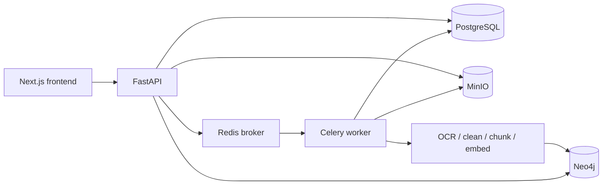

# Agent-RAG

Agent-RAG la he thong hoi dap tai lieu theo mo hinh RAG, ket hop ingest da phuong thuc, Neo4j graph, worker xu ly nen va giao dien Next.js.

## Kien Truc



- PostgreSQL la nguon du lieu chinh cho user, refresh token, chat session/message, upload job va document metadata.
- Redis chi dieu phoi Celery task va result ngan han; khong luu lich su nghiep vu.
- MinIO self-host luu file goc, markdown va metadata da xu ly.
- Neo4j chi luu knowledge graph, chunk va embedding.
- FastAPI xac thuc JWT, kiem tra ownership va khong xu ly chat/ingest trong process API.
- Celery worker xu ly chat va ingest, co retry, attempt count, worker ID va heartbeat; Celery Beat danh dau task mat heartbeat.

## Bao Mat

- Access JWT co thoi gian song ngan va duoc frontend giu trong memory.
- Refresh JWT nam trong cookie `HttpOnly`, duoc rotate va revoke qua PostgreSQL.
- Tat ca chat, upload va graph endpoint deu loc theo `user_id`; admin duoc truy cap API quan tri.
- `Document` va `Chunk` trong Neo4j co `owner_id`; retrieval worker lay owner tu task context.
- Frontend khong ket noi truc tiep Neo4j hoac MinIO.
- Neo4j, PostgreSQL va Redis khong publish port ra host trong Docker Compose.
- MinIO console chi bind `127.0.0.1`; file download di qua backend de kiem tra ownership.
- CORS dung allowlist tu `CORS_ORIGINS`; `/api/status` chi danh cho admin va khong tra database URI.

## Cau Truc

```text
backend/api/          # FastAPI routes, schemas, auth dependencies
backend/src/db/       # SQLAlchemy models va persistent store
backend/src/security/ # JWT, Argon2 password hashing, user context
backend/src/storage/  # MinIO adapter
backend/src/tasks/    # Celery app va chat/ingest tasks
backend/src/index/    # Neo4j indexing va graph queries
backend/src/retrieval/# vector search va graph expansion
backend/src/ingest/   # clean/chunk pipeline
migrations/           # Alembic migrations
frontend/             # Next.js application
tests/                # backend tests
```

## Chuan Bi Moi Truong

Yeu cau Docker Compose v2, NVIDIA driver va NVIDIA Container Toolkit. Neu chay local khong qua Docker, can Python 3.11+ va Node.js.

Tao `.env` tu `.env.example`, sau do thay moi gia tri `replace_with_*`. Co the tao secret bang:

```bash
openssl rand -base64 48
```

Nhung bien bat buoc khi chay Docker:

```bash
POSTGRES_PASSWORD=<strong-random-secret>
REDIS_PASSWORD=<strong-random-secret>
MINIO_ROOT_PASSWORD=<strong-random-secret>
NEO4J_PASSWORD=<strong-random-secret>
JWT_SECRET=<at-least-32-random-bytes>
```

Production nen cau hinh them:

```bash
ENVIRONMENT=production
COOKIE_SECURE=true
ALLOW_FIRST_USER_ADMIN=false
BOOTSTRAP_ADMIN_EMAIL=admin@example.com
BOOTSTRAP_ADMIN_PASSWORD=<strong-admin-password>
CORS_ORIGINS=https://your-frontend.example.com
```

Neu volume Neo4j da duoc khoi tao bang password cu, doi password trong database truoc. Sua `NEO4J_AUTH` khong tu dong doi credential cua volume hien co.

## Khoi Dong

Linux voi Make:

```bash
make
```

Hoac chay toan bo stack bang Docker Compose:

```bash
docker compose up -d --build
```

Compose chi target NVIDIA: Ollama va Celery ingest worker deu duoc cap `gpus: all`. Cac dia chi local:

- Frontend: http://localhost:3000
- Backend API/OpenAPI: http://localhost:8000/docs
- MinIO Console: http://127.0.0.1:9001

Neo4j Browser va Bolt khong duoc publish khoi Docker network. Frontend doc graph qua FastAPI.

Theo doi worker va API:

```bash
docker compose logs -f backend worker beat
```

Chay frontend development:

```bash
make frontend-dev
```

Frontend dung `NEXT_PUBLIC_API_BASE_URL`, mac dinh `http://localhost:8000/api`.

## Database Migration

Backend container chay migration truoc khi khoi dong Uvicorn. Chay thu cong:

```bash
poetry run alembic upgrade head
```

Tao migration moi sau khi sua SQLAlchemy models:

```bash
poetry run alembic revision --autogenerate -m "describe change"
```

## API

Public endpoints:

```text
GET  /api/health
POST /api/auth/register
POST /api/auth/login
POST /api/auth/refresh
POST /api/auth/logout
```

User endpoints yeu cau `Authorization: Bearer <access-token>`:

```text
GET  /api/users/me
POST /api/chat
GET  /api/chat/{run_id}
GET  /api/chat/sessions
GET  /api/chat/sessions/{run_id}
POST /api/documents/upload
GET  /api/documents/uploads
GET  /api/documents/upload/{job_id}
GET  /api/documents/upload/{job_id}/download
GET  /api/graph/documents
GET  /api/graph/document?source=<source>
```

Admin endpoints:

```text
GET /api/admin/users
GET /api/admin/uploads
GET /api/admin/chat-sessions
GET /api/admin/users/{user_id}/uploads
GET /api/admin/users/{user_id}/chat-sessions
GET /api/status
```

Upload flow:

1. API validate extension, size va ownership.
2. API luu file goc vao MinIO.
3. API ghi upload job vao PostgreSQL va enqueue Celery task qua Redis.
4. Worker tai object, xu ly va index Neo4j theo `owner_id`.
5. Worker day markdown/metadata vao MinIO va cap nhat progress trong PostgreSQL.

## Kiem Thu

```bash
poetry run python -m pytest -q
cd frontend
npm run build
```
