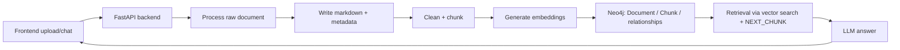

# Agent-RAG

Agent-RAG là một hệ thống hỏi đáp tài liệu theo mô hình RAG, kết hợp ingest đa phương thức, embedding, Neo4j graph, và giao diện web để chat và nạp tài liệu vào kho tri thức.

## Tổng quan

Mục tiêu của dự án là:

- Nạp tài liệu từ file `.pdf`, `.docx`, `.md`, ảnh và một số tài liệu có hình minh họa.
- Trích xuất nội dung văn bản, OCR, mô tả ảnh, rồi chuẩn hóa thành markdown.
- Chia nhỏ nội dung thành các chunk, tạo embedding, và lưu vào Neo4j.
- Truy hồi nội dung bằng vector search + mở rộng theo quan hệ `NEXT_CHUNK`.
- Cung cấp giao diện web để upload tài liệu, theo dõi trạng thái ingest, và chat với dữ liệu đã index.

## Kiến Trúc

Hệ thống gồm 5 khối chính:

1. Frontend
   - Giao diện tĩnh chạy qua Nginx trong thư mục `frontend/`.
   - Hỗ trợ upload tài liệu, xem trạng thái ingest, và gửi câu hỏi chat.

2. Backend API
   - FastAPI trong `backend/api/`.
   - Cung cấp các endpoint cho health check, chat, upload tài liệu, xem trạng thái job, và xem graph document.

3. Ingest pipeline
   - Code xử lý file nằm trong `backend/process_raw_data/` và `backend/src/tools/processData_tool.py`.
   - File được lưu vào `data/raw`, xử lý sang markdown trong `data/processed`, rồi index vào Neo4j.

4. Graph index và retrieval
   - Lưu các node `Document`, `Chunk` và quan hệ `HAS_CHUNK`, `NEXT_CHUNK` trong Neo4j.
   - Tìm kiếm theo embedding và rerank trong `backend/src/retrieval/` và `backend/src/index/`.

5. Model services
   - Ollama được dùng cho embedding và một số tác vụ LLM/VLM tùy cấu hình.
   - Neo4j lưu graph và vector index.

### Luồng dữ liệu



## Cấu trúc thư mục

```text
backend/
  api/                # FastAPI app và schema
  process_raw_data/   # OCR, vision, xử lý PDF/DOCX/MD/ảnh
  src/
    agents/           # orchestrator và agent tools
    index/            # tạo graph, list document, get graph detail
    ingest/           # loader, cleaner, chunker
    retrieval/        # graph search
    tools/            # tool ingest và retrieval
frontend/             # giao diện web tĩnh + Nginx
data/raw/             # file gốc upload vào
data/processed/       # markdown và metadata đã xử lý
tests/                # test ingest và vision
```

## Yêu Cầu Hệ Thống

- Docker và Docker Compose v2.
- Linux hoặc môi trường có hỗ trợ Docker.
- Nếu chạy local không qua Docker, cần Python 3.11+ và các dịch vụ Neo4j, Ollama, model endpoint tương ứng.

## Cài Đặt Nhanh Bằng Docker

### 1. Clone repository

```bash
git clone <repo-url>
cd Agent-RAG
```

### 2. Chuẩn bị file `.env`

Repo dùng `.env` để cấu hình model, Neo4j, Ollama, và token. Các biến quan trọng gồm:

```bash
COMPOSE_PROFILES=nvidia
OLLAMA_API_KEY=your_ollama_api_key
LLM_MODEL_NAME=your_chat_model
VISION_MODEL_NAME=your_vision_model
LLM_MODEL_CHUNKER=your_chunker_model
EMBEDDING_MODEL_NAME=nomic-embed-text
OLLAMA_BASE_URL=https://ollama.com/v1
OLLAMA_LOCAL_URL=http://localhost:11434/v1
NEO4J_URI=bolt://localhost:7687
NEO4J_USERNAME=neo4j
NEO4J_PASSWORD=password
```

Ghi chú:

- Nếu chạy với Docker Compose trong cùng network, backend sẽ dùng `bolt://neo4j:7687` bên trong container.
- `make` sẽ tự dò profile GPU để chọn `nvidia`, `amd`, hoặc `intel` cho Ollama; nếu không dò được thì mặc định vẫn chọn `nvidia`.
- Trên Windows + Docker Desktop, chỉ `ollama-nvidia` dùng GPU trực tiếp. `backend` không cần mount `/dev/kfd` hay `/dev/dri`.

### 3. Khởi động hệ thống

#### Cách khuyến nghị

```bash
make # Cho Linux/Ubuntu
```

Lệnh này sẽ:

- Dò GPU hiện có.
- Khởi chạy `neo4j`, service Ollama phù hợp với profile, và `backend`.

#### Chạy trên Windows + Docker Desktop + NVIDIA

```bash
docker compose --profile nvidia up -d --build
```

Ghi chú:

- Docker Desktop chạy Linux containers qua WSL2, nhưng GPU vẫn được cấp từ máy Windows host.
- Với cấu hình hiện tại, GPU được dùng ở service `ollama-nvidia`.
- `backend` chỉ gọi Ollama qua HTTP nên không cần mount device Linux GPU.

#### Nếu muốn chạy đầy đủ cả frontend

```bash
docker compose --profile cpu up -d --build
```

Nếu máy bạn có GPU khác, thay `cpu` bằng profile tương ứng:

- `nvidia`
- `amd`
- `intel`

### 4. Mở ứng dụng

- Frontend: http://localhost:3000
- Backend API: http://localhost:8000
- Neo4j Browser: http://localhost:7474

Thông tin đăng nhập Neo4j mặc định trong compose:

- username: `neo4j`
- password: `password`

## Chạy Từng Thành Phần

### Backend riêng

```bash
docker compose --profile cpu up -d neo4j ollama-cpu backend
```

### Frontend riêng

```bash
docker compose up -d frontend
```

### Frontend local không qua Docker

Khi backend đang chạy ở `http://127.0.0.1:8000`, bạn có thể chạy frontend local để sửa UI mà không cần rebuild image:

```bash
make frontend-dev
```

Lệnh này sẽ:

- serve thư mục `frontend/` ở `http://127.0.0.1:3000`
- proxy mọi request `/api/*` sang backend `http://127.0.0.1:8000`

Nhờ vậy bạn chỉ cần sửa file trong `frontend/` rồi refresh trình duyệt.

### Kiểm tra trạng thái

```bash
docker ps
docker logs -f agent-rag-backend-1
```

## API Chính

### Health check

```bash
GET /api/health
```

### Chat

```bash
POST /api/chat
```

Body:

```json
{
  "message": "LLMOps la gi?"
}
```

Endpoint này trả về `run_id` ngay để frontend hoặc client có thể theo dõi agent đang làm gì theo từng bước.

### Xem trạng thái agent run

```bash
GET /api/chat/{run_id}
```

Response sẽ gồm:

- `status`: `queued`, `processing`, `completed`, hoặc `failed`
- `message`: trạng thái mới nhất của agent
- `answer`: câu trả lời cuối nếu đã xong
- `events`: danh sách các bước như orchestrator start, retrieval, vector search, graph expansion, rerank

### Upload tài liệu

```bash
POST /api/documents/upload
```

Endpoint này trả về job ID và trạng thái ingest. File sẽ được xử lý ở background, vì vậy UI có thể theo dõi tiến trình mà không bị treo trong lúc chờ.

### Xem trạng thái upload

```bash
GET /api/documents/upload/{job_id}
```

### Xem danh sách tài liệu đã index

```bash
GET /api/graph/documents
```

### Xem graph của một tài liệu

```bash
GET /api/graph/document?source=<source_path>
```

## Neo4j Data Model

Hệ thống lưu dữ liệu theo mô hình sau:

- `Document`
  - Thuộc tính thường dùng: `source`, `name`, `raw_source`, `original_file_name`, `source_type`, `chunk_count`, `indexed_chunks`, `updated_at`
- `Chunk`
  - Thuộc tính thường dùng: `id`, `text`, `source`, `chunk_index`, `embedding`, `updated_at`
- Quan hệ
  - `(:Document)-[:HAS_CHUNK]->(:Chunk)`
  - `(:Chunk)-[:NEXT_CHUNK]->(:Chunk)`

Neo4j cũng tạo vector index `document_chunks` để phục vụ truy hồi semantic search.
